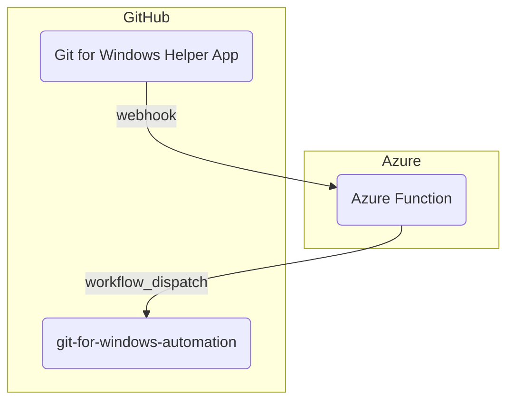
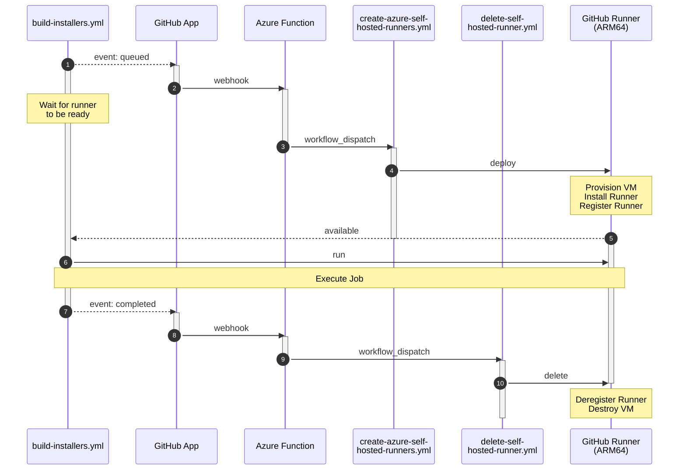

# Architecture

## High-Level Overview

### GitHub App

TODO

### Azure Function

TODO

### Automation Workflows

TODO

## Example: Windows/ARM64 Runners

1. The GitHub App receives an event that a workflow is queued.
2. The GitHub App notifies the Azure Function via a webhook.
3. The Azure Function receives the event and sees this is a workflow that requires an 'Windows/ARM64' runner.
   The function triggers the `create-azure-self-hosted-runners.yml` workflow via `workflow_dispatch`.
4. The workflow authenticates to Azure, provisions a VM via ARM, installing the GitHub runner, and registers it with GitHub.
5. The runner is now marked as available with the labels 'Windows/ARM64'.
6. The job starts to run on the new 'Windows/ARM64' runner.
7. The workflow completes and the GitHub App receives the event.
8. The GitHub App notifies the Azure Function via a webhook.
9. The Azure Function receives the event and triggers the `delete-self-hosted-runner.yml` workflow via `workflow_dispatch`.
10. The workflow starts to run, authenticates to Azure, deregisters the runner from GitHub, and destroys the VM.
